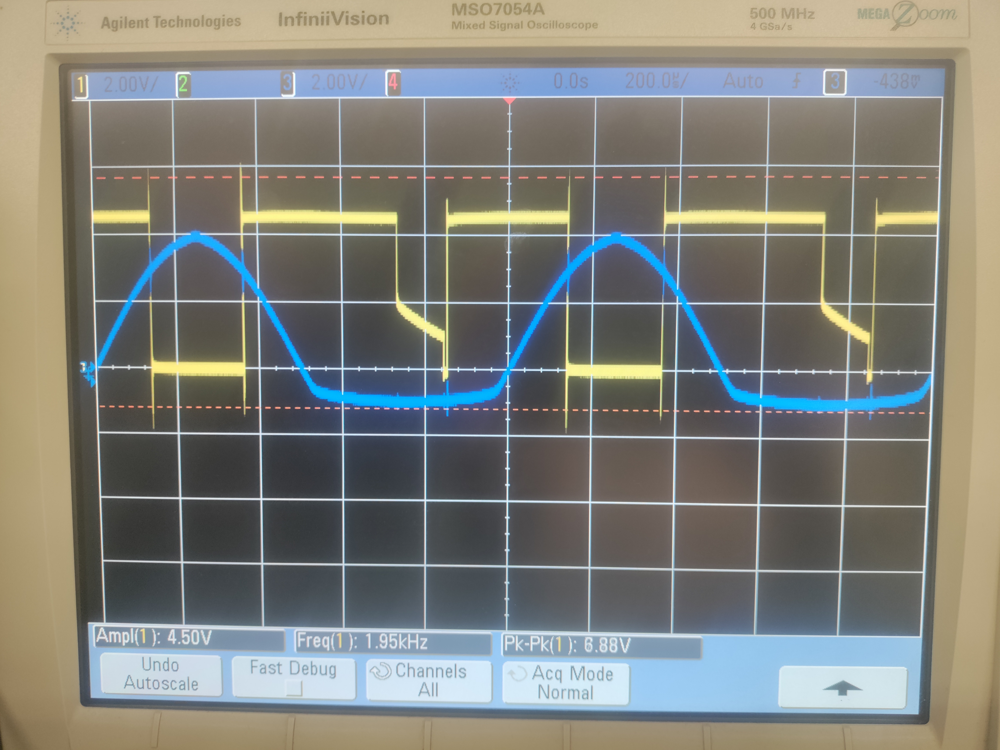
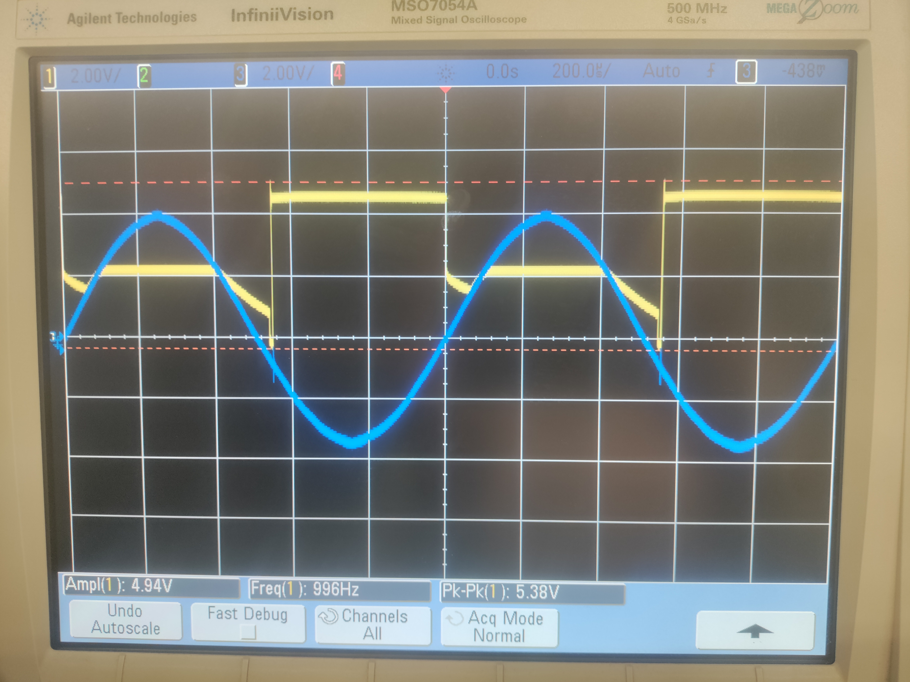
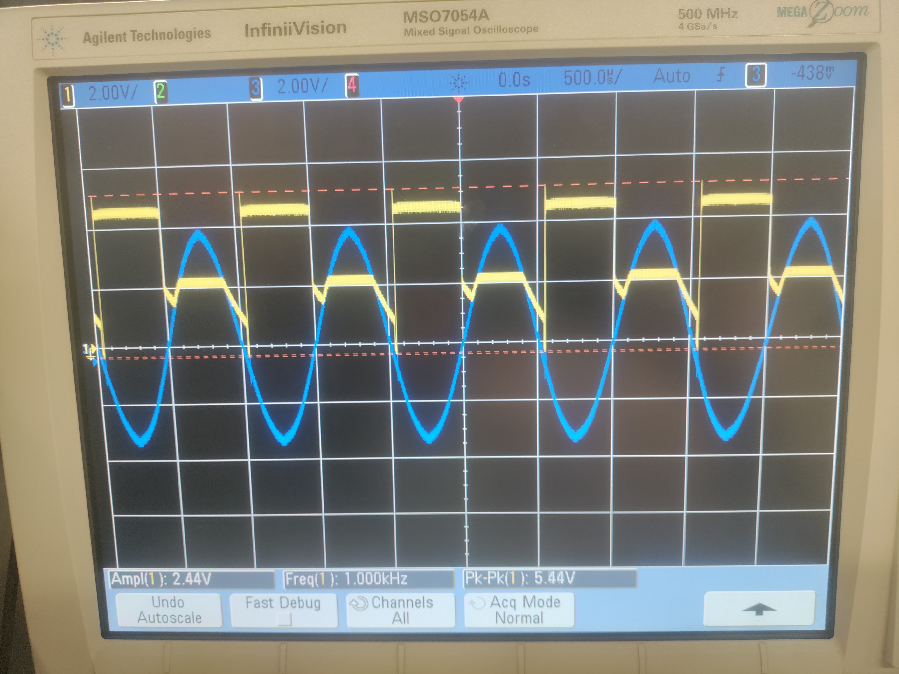

# Microcontrollers in Smart Systems — Labs & Project

> Coursework project from **EGR 338: Microcontrollers in Smart Sys (2024 Spring)** (2024 Spring C).

**Course:** EGR 338: Microcontrollers in Smart Sys (2024 Spring) — 2024 Spring C  ·  **Area:** hardware, embedded

## Overview
This repository contains my submitted deliverables for the project below. The course assignment brief (verbatim, abbreviated):

> Final Design Project Report Rubric-1.xlsx

## Tools & Tech
- PDF report

## Repository Structure
```
docs/555_Pins_Value_Table.docx
docs/Code_C.docx
docs/EGR338_Powerpoint_3_.pdf
docs/EGR338_Report_3_.pdf
docs/Laboratory_1.19_Week_1_Flashing_LED_s_Combinational_Logic.docx.pdf
docs/Laboratory_2.19_Week_3_Comparators.docx
docs/Laboratory_3.19_Week_6_True_Correct_UART_Slave_RX_PIC16F887_C-Code.doc
docs/Laboratory_3.19_Week_6_True_Correct_uart.h_C-Code.docx
docs/Laboratory_3.19_Week_6_UART_SPI_I2C.docx
docs/Laboratory_4.19_Week_11_Digital_Potentiometer.docx
images/IMG_20240207_153908.jpg
images/IMG_20240207_153912.jpg
images/IMG_20240207_154121_1_.jpg
images/IMG_20240207_155102.jpg
images/image0.jpeg
images/image2.jpeg
src/Laboratory_3.19_Week_6_True_Correct_UART_Master_TX_PIC16F917_C-Code.do
```

## Results
See the report(s)/presentation(s) in `docs/` — e.g. `docs/Laboratory_1.19_Week_1_Flashing_LED_s_Combinational_Logic.docx.pdf`.

## Preview





## License
Released under the MIT License — see `LICENSE`.

---
_Part of my engineering coursework portfolio. Deliverables only; routine homework, quizzes, and exams are intentionally excluded._